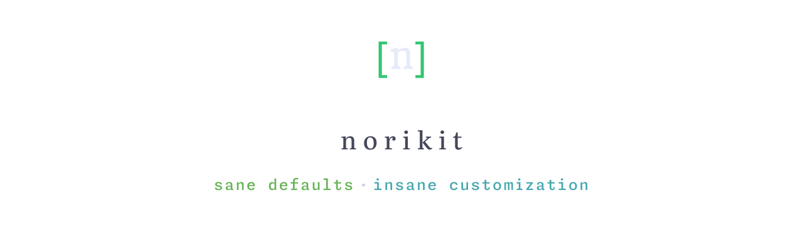
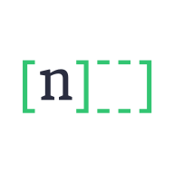
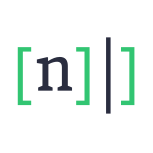
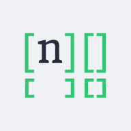
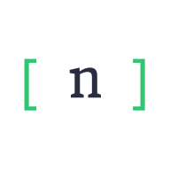
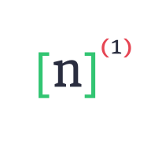
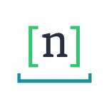
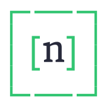
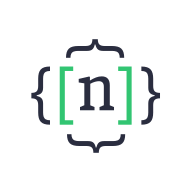

  <picture>
    <source media="(prefers-color-scheme: dark)" srcset="assets/hero-dark.svg"/>
    <source media="(prefers-color-scheme: light)" srcset="assets/hero-light.svg"/>
    
  </picture>

  A suite of native macOS desktop-customization tools for the ricing community — 
  fast, hackable, and visually cohesive by design.

---

Small, focused tools that each do one thing well — your menu bar, your themes, your
windows — built on Apple's own frameworks for low latency and idle-to-near-zero CPU, and
wired through a [shared theming layer](https://github.com/norikit/noriglaze) so your whole
setup stays consistent. Polished out of the box for newcomers, a framework all the way down
for enthusiasts.

## The toolkit

<!-- norikit:roster:start -->
<!-- DO NOT EDIT — generated from ai-docs/projects.toml by tools/gen_roster.py. -->

| | Tool | What it is | Status |
|:--:|---|---|---|
| <picture><source media="(prefers-color-scheme: dark)" srcset="assets/noribar-dark.svg"></picture> | [**noribar**](https://github.com/norikit/noribar) | Menu-bar replacement built around native, fully-animated SF Symbols. Swift + AppKit + embedded Lua. | 🚧 Active |
| <picture><source media="(prefers-color-scheme: dark)" srcset="assets/noricore-dark.svg"></picture> | [**noricore**](https://github.com/norikit/noricore) | Event broker & data backbone — aggregates system state and serves it to every tool. | 🌱 Early |
| <picture><source media="(prefers-color-scheme: dark)" srcset="assets/noricut-dark.svg"></picture> | [**noricut**](https://github.com/norikit/noricut) | Cross-app hotkey/shortcut daemon (NWP protocol). | 🌱 Early |
| <picture><source media="(prefers-color-scheme: dark)" srcset="assets/noriglaze-dark.svg"></picture> | [**noriglaze**](https://github.com/norikit/noriglaze) | Theme manager — one switch retheme every norikit tool at once. | 🌱 Early |
| <picture><source media="(prefers-color-scheme: dark)" srcset="assets/noribento-dark.svg"></picture> | [**noribento**](https://github.com/norikit/noribento) | Fast, keyboard-driven tiling window manager, i3-style. | 🥚 Stub |
| <picture><source media="(prefers-color-scheme: dark)" srcset="assets/noribox-dark.svg"></picture> | [**noribox**](https://github.com/norikit/noribox) | Omnibox launcher — apps, commands, and search in one box. | 🥚 Stub |
| <picture><source media="(prefers-color-scheme: dark)" srcset="assets/norify-dark.svg"></picture> | [**norify**](https://github.com/norikit/norify) | Notification engine for the ecosystem. | 🥚 Stub |
| <picture><source media="(prefers-color-scheme: dark)" srcset="assets/noripad-dark.svg"></picture> | [**noripad**](https://github.com/norikit/noripad) | Clipboard manager — searchable history, pinning, quick paste. | 🥚 Stub |
| <picture><source media="(prefers-color-scheme: dark)" srcset="assets/noripaper-dark.svg"></picture> | [**noripaper**](https://github.com/norikit/noripaper) | Wallpaper engine — static and animated, hot-swapped on theme change. | 🥚 Stub |
| <picture><source media="(prefers-color-scheme: dark)" srcset="assets/noriset-dark.svg"></picture> | [**noriset**](https://github.com/norikit/noriset) | The bundler — combines all norikit tooling into one plug-and-play package. | 🥚 Stub |
<!-- norikit:roster:end -->

Every project is open source under [AGPL-3.0](https://www.gnu.org/licenses/agpl-3.0.en.html).

  Start at <a href="https://github.com/norikit/norikit">norikit/norikit</a> for the full story · Built for ricers, by ricers 🌿

